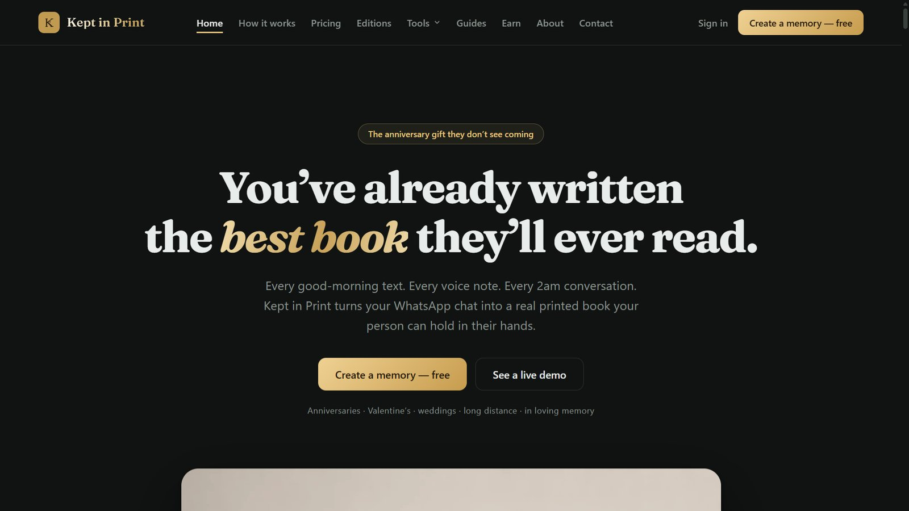

# Kept In Print

Turns a WhatsApp chat export into a printed keepsake book. Live at
[keptinprint.co.za](https://keptinprint.co.za).



It started as a one-off gift: take a couple's chat history, lay it out so it still looks like
WhatsApp, and get it bound. The hard part was never the parsing. It was making a printed page look
enough like the app that the person opening it recognises their own conversation.

## What it does

**Parsing.** WhatsApp's `.txt` export is not one format, it is several. The parser handles iOS and
Android layouts, 12- and 24-hour clocks, edited-message markers, attachment references, deleted
messages, and system events like pinned messages and group changes. Media in the export ZIP is
matched back to the message that referenced it.

**Rendering.** The book reproduces the WhatsApp interface rather than approximating it: both
themes, the real doodle wallpaper, bubble tails, read receipts, reply quotes, polls, per-participant
profile photos, link-preview cards, sticker and video thumbnails, and voice notes drawn as
waveforms with their real durations.

**Print.** A5 pages, two columns, with pagination that never orphans a bubble across a page break.
The PDF is generated server-side through headless Chromium, then imposed into printer signatures
so it can go straight to a press. A cover generator handles spine width from the page count.

**The rest of the product.** Named projects with save history, a live phone-frame preview, a free
watermarked tier alongside the paid Keepsake and Heirloom editions, Paystack checkout, order and
library pages, certificates of authenticity, and a referral and ambassador programme.

## Architecture

```
src/app/            Next.js App Router — marketing, maker, library, orders, SEO pages
src/app/api/        upload, parse, render, render-job, stitch, impose, checkout,
                    paystack webhook, entitlements, referral, og, analytics
src/components/     ChatBook renderer, Reader, ImposeTool, maker/ tools/ seo/
src/lib/            parse, pdf, imposemath, presssplit, printcover, keepsake,
                    heirloom, entitlements, paystack, firebase, mail
```

Rendering runs as a job rather than a request: `render-job` queues the work, Puppeteer with
`@sparticuz/chromium` produces the pages on a serverless function, and `stitch` and `impose`
assemble the final PDF with `pdf-lib`. Large exports would blow a single request budget, so they
don't get one.

The SEO surface (`compare/`, `guides/`, `gifts/`) is programmatic — one template, a content source,
a hub page and internal links, with `sitemap.ts` and `robots.ts` generated from the same data.

## Stack

| | |
| --- | --- |
| Framework | Next.js 16 (App Router), React 19, TypeScript |
| Auth &amp; data | Firebase (client + admin SDK) |
| Payments | Paystack |
| PDF | Puppeteer Core + `@sparticuz/chromium`, `pdf-lib`, `pdfjs-dist`, jsPDF |
| Storage | Vercel Blob |
| Mail | Nodemailer + ImapFlow / mailparser for the inbound side |
| Hosting | Vercel |

## The second tool — Document Editor

Kept In Print is becoming a small suite. The second tool takes a scanned PDF or a photo of a
document, recovers the typography actually used in it, and edits the text so the result is
indistinguishable from an untouched region of the same page.

### The problem

Editing a scan is normally either a lie or a mess. OCR-and-retype gives you the words in the wrong
font. Cover-and-overtype leaves a visible patch. The only honest way is to harvest the glyphs that
are already on the page, learn the type from them, erase cleanly, and stamp new text back using
the harvested forms.

That is what this does, and the eval harness exists so I can tell whether it worked rather than
squint at it.

### Pipeline

```
ingest → rectify → OCR (swappable engine) → character boxes → style clusters
       → blocks with reading order → glyph harvest → erase → stamp compose
       → edit log with undo → PDF export with provenance
```

**Style clusters** group characters that share a typeface, weight and size, so "the font on this
page" is a measured cluster rather than a guess. **Autofit** decides how replacement text flows
when it doesn't match the original's width. Every edit is logged, so export carries provenance:
what was changed, and from what.

### Evaluation

Phases 0–2 are built. There's a 50-document corpus with exact ground truth and a harness that
scores character-box accuracy against it. Measured numbers live in `eval/reports/`; the decisions
and the evidence behind them are in `DECISIONS.md`.

I'd rather publish a number that's mediocre than a claim that's unfalsifiable, so the reports are
in the repo.

## Status

ChatBook is live and selling. The Document Editor has phases 0–2 built.

---

<sub>Source is private — this repo is the write-up. [Shaun Madondo](https://github.com/TheC0deJunkie) · Durban, KwaZulu-Natal.</sub>
